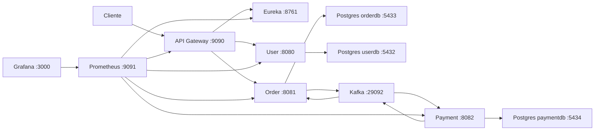

# Microservices

Projeto de exemplo em Java com Spring Boot para demonstrar uma arquitetura de microservicos com autenticacao JWT, API Gateway, descoberta de servicos com Eureka, pedidos, processamento assincrono de pagamentos com Kafka, outbox transacional e resiliencia.

## Visao Geral

Todo trafego HTTP externo entra pela API Gateway. A gateway valida o JWT localmente e encaminha as chamadas para os servicos registrados no Eureka. O servico `user` continua mantendo sua propria seguranca, mesmo com a autenticacao centralizada na gateway.

Pedidos sao criados pelo servico `order`. Ao salvar um pedido, o servico tambem grava um evento em sua tabela de outbox dentro da mesma transacao. Um publisher agendado publica esse evento no Kafka. O servico `payment` consome o pedido de pagamento, processa o pagamento com retry/circuit breaker/fallback e grava o resultado em sua propria outbox. O `order` consome o resultado e atualiza o status do pedido.

Todos os servicos expoem metricas via Spring Boot Actuator e Prometheus. A gateway tambem cria ou reaproveita o header `X-Correlation-Id`, propaga para os servicos internos e inclui esse valor nos logs para facilitar rastreio ponta a ponta.



## Stack

- Java 25 com Amazon Corretto.
- Maven 3.9.x.
- Spring Boot 4.x.
- Spring Cloud 2025.1.x.
- Spring Cloud Netflix Eureka.
- Spring Cloud Gateway WebFlux.
- Spring Security com JWT usando Auth0 `java-jwt`.
- Spring MVC, Spring Data JPA, Hibernate e PostgreSQL.
- Flyway para migrations de banco.
- Spring Kafka para eventos de pagamento.
- Transactional Outbox para publicacao confiavel de eventos.
- Resilience4j para retry, circuit breaker e fallback.
- Spring Boot Actuator e Micrometer Prometheus para metricas.
- Prometheus e Grafana para observabilidade local.
- Testcontainers para testes de integracao com Kafka/PostgreSQL.
- Docker Compose para orquestracao local.

## Servicos

| Servico | Porta | Responsabilidade |
| --- | ---: | --- |
| `eureka` | 8761 | Service registry para descoberta entre os servicos. |
| `gateway` | 9090 | Entrada HTTP externa, validacao JWT e roteamento via load balancer. |
| `user` | 8080 | Cadastro, autenticacao, JWT, roles e seguranca propria. |
| `order` | 8081 | Criacao e consulta de pedidos; publica solicitacoes de pagamento via outbox/Kafka. |
| `payment` | 8082 | Processa pagamentos, aplica resiliencia e publica resultado via outbox/Kafka. |

## Observabilidade

| Componente | URL local | Uso |
| --- | --- | --- |
| Prometheus | `http://localhost:9091` | Coleta metricas dos endpoints `/actuator/prometheus`. |
| Grafana | `http://localhost:3000` | Dashboards locais com datasource Prometheus provisionado. |
| Eureka metrics | `http://localhost:8761/actuator/prometheus` | Metricas do service registry. |
| Gateway metrics | `http://localhost:9090/actuator/prometheus` | Metricas da entrada HTTP publica. |
| User metrics | `http://localhost:8080/actuator/prometheus` | Metricas de autenticacao e usuarios. |
| Order metrics | `http://localhost:8081/actuator/prometheus` | Metricas de pedidos e outbox. |
| Payment metrics | `http://localhost:8082/actuator/prometheus` | Metricas de pagamentos, retry e circuit breaker. |

O Grafana usa usuario `admin` e senha `admin` no ambiente local.

Dashboards provisionados:

- `Microservices - Business Overview`: pedidos, pagamentos, fallback e outbox.
- `Microservices - Technical Overview`: targets, HTTP, JVM, CPU e Resilience4j.

Metricas customizadas de negocio:

- `business_orders_created_events_total`: pedidos criados por status.
- `business_orders_current`: quantidade atual de pedidos por status.
- `business_orders_payment_status_updated_total`: atualizacoes de status de pagamento do pedido.
- `business_orders_amount_sum`: valor total dos pedidos criados.
- `business_payments_processed_total`: pagamentos processados por status.
- `business_payments_current`: quantidade atual de pagamentos por status.
- `business_payments_amount_sum`: valor de pagamentos processados por status.
- `business_payments_fallback_total`: pagamentos finalizados por fallback.
- `business_outbox_events_current`: eventos de outbox por servico e status.
- `business_outbox_publish_attempts_total`: tentativas de publicacao de outbox.
- `business_outbox_publish_results_total`: resultado das publicacoes de outbox.

Correlation ID:

- Requests sem `X-Correlation-Id` recebem um UUID gerado pela gateway.
- Requests com `X-Correlation-Id` reaproveitam o valor informado.
- A gateway propaga o header para `user`, `order` e demais rotas.
- Cada servico devolve `X-Correlation-Id` na resposta e registra o valor no MDC dos logs.

## Bancos e Kafka

| Recurso | Porta Host | Banco/Topico |
| --- | ---: | --- |
| `user-postgres` | 5432 | `userdb` |
| `order-postgres` | 5433 | `orderdb` |
| `payment-postgres` | 5434 | `paymentdb` |
| `kafka` | 29092 | `payment-requests`, `payment-results` |

Cada servico que possui banco e dono do seu schema. As migrations ficam em:

- `user/src/main/resources/db/migration`
- `order/src/main/resources/db/migration`
- `payment/src/main/resources/db/migration`

O Hibernate esta configurado com `ddl-auto: validate`. Mudancas de schema devem ser feitas criando uma nova migration Flyway, nao alterando tabelas automaticamente pelo Hibernate.

## Como Rodar

Suba todo o ambiente:

```bash
docker compose up --build
```

Para rodar em segundo plano:

```bash
docker compose up -d --build
docker compose ps
```

Para encerrar:

```bash
docker compose down
```

Se quiser recriar os bancos do zero:

```bash
docker compose down -v
docker compose up --build
```

## Testes

Rode os testes por modulo:

```bash
cd gateway && mvn test
cd user && mvn test
cd order && mvn test
cd payment && mvn test
cd eureka && mvn test
```

Os testes de `order` e `payment` usam Testcontainers para subir PostgreSQL e Kafka isolados.

## Fluxo de Autenticacao

1. O cliente chama uma rota publica do `user`, como login.
2. O `user` gera um JWT assinado com `JWT_SECRET`.
3. Chamadas protegidas passam pela `gateway` com `Authorization: Bearer <token>`.
4. A `gateway` valida assinatura e expiracao do JWT.
5. O servico de destino tambem aplica suas regras locais de seguranca.

O mesmo `JWT_SECRET` deve ser usado por `gateway` e `user`.

## Fluxo de Pedido e Pagamento

1. Cliente cria um pedido pela gateway.
2. `order` salva o pedido com status `PENDING_PAYMENT`.
3. `order` grava um evento em `order_outbox` na mesma transacao.
4. O publisher de outbox publica em `payment-requests`.
5. `payment` consome o evento, processa o pagamento e aplica retry/circuit breaker/fallback.
6. `payment` grava o resultado em `payment_outbox`.
7. O publisher do `payment` publica em `payment-results`.
8. `order` consome o resultado e muda o pedido para `PAID` ou `PAYMENT_FAILED`.

## Smoke Test

Com o Docker Compose em execucao, faca login:

```bash
curl -X POST http://localhost:9090/api/v1/auth/login \
  -H "Content-Type: application/json" \
  -d "{\"login\":\"admin\",\"password\":\"Admin@123\"}"
```

Use o token retornado para criar um pedido:

```bash
curl -X POST http://localhost:9090/api/v1/orders \
  -H "Content-Type: application/json" \
  -H "Authorization: Bearer <TOKEN>" \
  -d "{\"customerId\":\"11111111-1111-1111-1111-111111111111\",\"items\":[{\"productId\":\"p1\",\"productName\":\"Pizza\",\"quantity\":2,\"unitPrice\":10.00}]}"
```

Consulte o pedido:

```bash
curl http://localhost:9090/api/v1/orders/<ORDER_ID> \
  -H "Authorization: Bearer <TOKEN>"
```

O status deve iniciar como `PENDING_PAYMENT` e depois mudar para `PAID` ou `PAYMENT_FAILED`, dependendo do processamento do pagamento.

Teste rapido de observabilidade:

```bash
curl -i http://localhost:9090/actuator/health -H "X-Correlation-Id: smoke-123"
curl http://localhost:9091/-/ready
```

## Documentacao

- `docs/maintenance-guide.md`: guia completo para manutencao futura.
- `docs/codex/project-context.md`: arquitetura, portas, containers e fluxo principal.
- `docs/codex/services.md`: responsabilidades, rotas e pacotes por servico.
- `docs/codex/development.md`: comandos, ambiente local, testes e checklist.
- `observability/prometheus/prometheus.yml`: configuracao de scrape do Prometheus.
- `observability/grafana/provisioning`: datasource e dashboards provisionados no Grafana.
- `observability/grafana/dashboards`: dashboards versionados do Grafana.
- `AGENTS.md`: instrucoes duraveis para o Codex trabalhar neste repositorio.

## Regras de Manutencao

- Preserve a arquitetura hexagonal do `user`.
- Preserve a arquitetura limpa em `order` e `payment`.
- Nao remova a seguranca local do `user`.
- Nao altere contrato OpenAPI do `user` sem ajustar implementacao e testes.
- Mudancas de schema devem ganhar nova migration Flyway.
- Mudancas em eventos Kafka devem considerar produtor, consumidor, payload, testes e compatibilidade.
- Para mudancas em gateway/autenticacao, teste rota publica, token ausente, token invalido e token valido.
- Preserve endpoints de Actuator/Prometheus e propagacao de `X-Correlation-Id` ao alterar gateway ou filtros HTTP.
