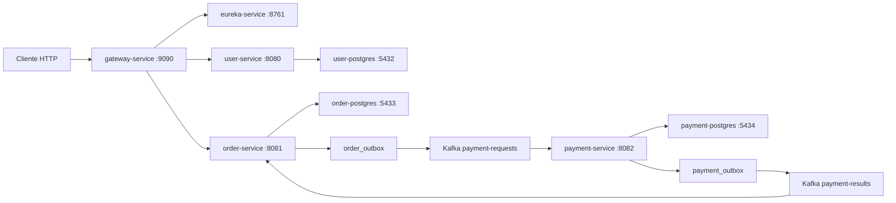

# Guia de Manutencao do Projeto

Este documento explica a aplicacao para um dev conseguir rodar, entender e manter os microsservicos sem depender de contexto oral. Ele complementa `AGENTS.md` e os arquivos em `docs/codex/`.

## Visao Geral

O projeto e uma plataforma de microsservicos em Java com Spring Boot. Todo trafego HTTP externo entra pelo API Gateway, que usa Eureka para descobrir os servicos internos. O servico `user` cuida de usuarios, autenticacao e autorizacao. O servico `order` cria pedidos e dispara pagamento de forma assincrona. O servico `payment` processa pagamentos via Kafka, com retry, circuit breaker, fallback e outbox pattern.

Fluxo principal:



## Stack

- Java 25, preferencialmente Amazon Corretto.
- Maven 3.9.x.
- Spring Boot 4.x.
- Spring Cloud 2025.1.x.
- Spring Cloud Netflix Eureka.
- Spring Cloud Gateway WebFlux.
- Spring Security com JWT via Auth0 `java-jwt`.
- Spring MVC, Spring Data JPA, Hibernate e PostgreSQL.
- Flyway para migrations de banco.
- Kafka via Spring Kafka.
- Resilience4j para retry e circuit breaker.
- Spring Boot Actuator, Micrometer Prometheus, Prometheus e Grafana para observabilidade.
- Testcontainers para integracao com Kafka e PostgreSQL nos testes.
- Docker Compose para orquestracao local.

Cada modulo Maven possui `.mvn/jvm.config` com `--sun-misc-unsafe-memory-access=allow` para reduzir avisos do JDK 25 vindos de dependencias transitivas antigas durante build/teste. Os POMs tambem configuram o `maven-surefire-plugin` com `byte-buddy-agent` para evitar autoanexacao dinamica do Mockito no JDK 25.

## Topologia Local

| Componente | Container | Porta host | Porta interna | Funcao |
|---|---|---:|---:|---|
| Eureka | `eureka-service` | `8761` | `8761` | Service registry |
| Gateway | `gateway-service` | `9090` | `9090` | Entrada HTTP publica |
| User | `user-service` | `8080` | `8080` | Usuarios, login e JWT |
| Order | `order-service` | `8081` | `8081` | Pedidos e status de pagamento |
| Payment | `payment-service` | `8082` | `8082` | Processamento de pagamento |
| Kafka | `kafka` | `29092` | `9092` | Broker interno |
| Prometheus | `prometheus` | `9091` | `9090` | Coleta metricas Actuator |
| Grafana | `grafana` | `3000` | `3000` | Visualizacao de metricas |
| User DB | `user-postgres` | `5432` | `5432` | Banco do user |
| Order DB | `order-postgres` | `5433` | `5432` | Banco do order |
| Payment DB | `payment-postgres` | `5434` | `5432` | Banco do payment |

URLs uteis:

- Eureka dashboard: `http://localhost:8761`.
- Gateway health: `http://localhost:9090/actuator/health`.
- User health: `http://localhost:8080/actuator/health`.
- Order health: `http://localhost:8081/actuator/health`.
- Payment health: `http://localhost:8082/actuator/health`.
- Prometheus: `http://localhost:9091`.
- Grafana: `http://localhost:3000` com usuario `admin` e senha `admin`.

## Como Rodar

Subir tudo:

```powershell
docker compose up --build
```

Subir em segundo plano:

```powershell
docker compose up -d --build
```

Ver status:

```powershell
docker compose ps
```

Parar sem apagar volumes:

```powershell
docker compose down
```

Rodar testes por modulo:

```powershell
cd eureka; mvn test
cd gateway; mvn test
cd user; mvn test
cd order; mvn test
cd payment; mvn test
```

## Autenticacao e Seguranca

O `user-service` gera JWT no login. O `gateway-service` valida o JWT localmente antes de encaminhar rotas protegidas. O `user-service` continua tendo sua propria seguranca, filtros e autorizacao por metodo; a seguranca de servico nao deve ser removida so porque a gateway autentica.

Configuracoes importantes:

- `JWT_SECRET` precisa ser igual no `gateway-service` e no `user-service`.
- Em Docker Compose, ambos usam `05b0f768-fe7b-49aa-b934-44ef29634de3`.
- O issuer esperado e `restaurant-api`.
- `JWT_EXPIRATION` pertence ao `user-service`.

Rotas publicas pela gateway:

- `POST /api/v1/auth/login`
- `POST /api/v1/users`
- `OPTIONS /**`
- `/actuator/**`

Rotas protegidas:

- `GET /api/v1/users`
- `GET /api/v1/users/{userId}`
- `PUT /api/v1/users/{userId}`
- `PATCH /api/v1/users/{userId}/password`
- `GET /api/v1/orders`
- `GET /api/v1/orders/{orderId}`
- `POST /api/v1/orders`

## Servicos

### Eureka

Modulo: `eureka`.

Responsabilidade unica: registrar e expor instancias dos demais servicos. Nao deve conter regra de negocio, autenticacao ou roteamento manual.

Pontos principais:

- Main class: `br.com.schiliga.eureka.EurekaApplication`.
- Config: `eureka/src/main/resources/application.yaml`.
- Teste: `eureka/src/test/java/br/com/schiliga/eureka/EurekaApplicationTests.java`.

### Gateway

Modulo: `gateway`.

Responsabilidades:

- Entrada HTTP publica.
- Validacao local de JWT para rotas protegidas.
- Roteamento para `lb://user` e `lb://order` via Eureka.

Pontos principais:

- Main class: `br.com.schiliga.gateway.GatewayApplication`.
- Rotas: `gateway/src/main/resources/application.yml`.
- Filtro JWT: `gateway/src/main/java/br/com/schiliga/gateway/security/JwtAuthenticationWebFilter.java`.
- Testes do filtro: `gateway/src/test/java/br/com/schiliga/gateway/security/JwtAuthenticationWebFilterTest.java`.

Ao alterar seguranca na gateway, cubra pelo menos: endpoint publico, token ausente, token invalido e token valido.

### User

Modulo: `user`.

Responsabilidades:

- Criar usuarios.
- Login e emissao de JWT.
- Validacao de token no proprio servico.
- Consulta, atualizacao e troca de senha com autorizacao.

Arquitetura:

- `application/domain`: entidades, value objects e regras do dominio.
- `application/ports/inbound`: portas consumidas por controllers/filtros.
- `application/ports/outbound`: contratos para persistencia, token e criptografia.
- `application/usecases`: casos de uso.
- `infrastructure/inbound`: controllers REST, security, mappers e exception handling.
- `infrastructure/outbound`: JPA, adapters de token e senha.
- `infrastructure/config`: beans e carga inicial.

OpenAPI:

- Fonte da verdade: `user/src/main/resources/api/openapi.yml`.
- O build gera interfaces e DTOs em `target/generated-sources/openapi`.
- Se mudar contrato HTTP, atualize OpenAPI, controller, mapper e testes juntos.

Credencial util no ambiente local inicial:

- Login: `admin`
- Senha: `Admin@123`

### Order

Modulo: `order`.

Responsabilidades:

- Criar pedido com status inicial `PENDING_PAYMENT`.
- Persistir itens e total.
- Gravar evento `PaymentRequested` em `order_outbox` na mesma transacao do pedido.
- Publicar eventos pendentes no Kafka.
- Consumir resultado de pagamento e atualizar pedido para `PAID` ou `PAYMENT_FAILED`.

Arquitetura:

- `application/domain/order`: entidade de pedido, item e status.
- `application/ports/inbound/order`: portas de criacao e consulta.
- `application/ports/outbound`: repositorio e publicacao de pagamento.
- `application/usecases/order`: orquestracao de negocio.
- `infrastructure/inbound/rest`: controller e DTOs HTTP.
- `infrastructure/inbound/kafka`: consumidor de resultado.
- `infrastructure/outbound/persistence`: JPA e adapters.
- `infrastructure/outbound/persistence/outbox`: entidade, repository e publisher de outbox.
- `infrastructure/outbound/kafka`: sender Kafka de baixo nivel.

Endpoints:

- `POST /api/v1/orders`
- `GET /api/v1/orders`
- `GET /api/v1/orders/{orderId}`

### Payment

Modulo: `payment`.

Responsabilidades:

- Consumir `payment-requests`.
- Processar pagamento com gateway simulado.
- Aplicar Resilience4j retry/circuit breaker/fallback.
- Persistir pagamento e evento `PaymentResult` em `payment_outbox`.
- Publicar resultado em `payment-results`.
- Encaminhar falhas de consumo para retry topics e DLT.

Arquitetura:

- `application/domain/payment`: pagamento, status e resultado de autorizacao.
- `application/ports/inbound/payment`: porta de processamento.
- `application/ports/outbound`: gateway, repositorio e publicacao de resultado.
- `application/usecases/payment`: regra de processamento.
- `infrastructure/inbound/kafka`: consumidor de pedido de pagamento e fallback DLT.
- `infrastructure/outbound/gateway`: gateway de pagamento simulado.
- `infrastructure/outbound/persistence`: JPA e adapters.
- `infrastructure/outbound/persistence/outbox`: entidade, repository e publisher de outbox.
- `infrastructure/outbound/kafka`: sender Kafka de baixo nivel.

Regra do simulador:

- Valores dentro do limite configurado sao aprovados.
- Valores acima do limite sao recusados com motivo `Amount exceeds simulated approval limit`.

## Kafka

Topicos principais:

- `payment-requests`: pedido de pagamento criado pelo `order`.
- `payment-results`: resultado publicado pelo `payment`.

Topicos de resiliencia:

- `payment-requests-retry-0`
- `payment-requests-retry-1`
- `payment-requests.DLT`

O `payment-service` usa retry topics do Spring Kafka para falhas no consumo. Falhas finais vao para DLT, onde o listener de fallback registra o problema sem derrubar o servico.

## Outbox Pattern

O projeto usa outbox para reduzir risco de inconsistencias entre banco e Kafka.

No `order`:

1. Caso de uso cria pedido.
2. Na mesma transacao, grava linha em `order_outbox`.
3. `OrderOutboxPublisher` busca linhas `PENDING`.
4. O publisher envia para `payment-requests`.
5. Em sucesso, marca a linha como `PUBLISHED`.
6. Em falha, incrementa `attempts` e guarda `last_error`.

No `payment`:

1. Caso de uso processa pagamento.
2. Na mesma transacao, grava linha em `payment_outbox`.
3. `PaymentOutboxPublisher` busca linhas `PENDING`.
4. O publisher envia para `payment-results`.
5. Em sucesso, marca a linha como `PUBLISHED`.
6. Em falha, incrementa `attempts` e guarda `last_error`.

Tabelas:

- `order_outbox`
- `payment_outbox`

Campos importantes:

- `id`: identificador do evento.
- `aggregate_id`: id do pedido/pagamento relacionado.
- `event_type`: tipo logico do evento.
- `topic`: topico Kafka destino.
- `payload`: JSON serializado.
- `status`: `PENDING` ou `PUBLISHED`.
- `attempts`: tentativas de publicacao.
- `next_attempt_at`: proxima tentativa permitida.
- `last_error`: ultima falha.
- `created_at`, `updated_at`, `published_at`.

Se um evento ficar preso em `PENDING`, verifique Kafka, logs do publisher e `last_error`.

## Observabilidade

Cada servico expoe Actuator com health, info, metrics e Prometheus. `user` e `payment` tambem expoem metricas de circuit breakers e retries do Resilience4j.

Endpoints locais:

- Eureka: `http://localhost:8761/actuator/prometheus`
- Gateway: `http://localhost:9090/actuator/prometheus`
- User: `http://localhost:8080/actuator/prometheus`
- Order: `http://localhost:8081/actuator/prometheus`
- Payment: `http://localhost:8082/actuator/prometheus`

Prometheus:

- Configuracao: `observability/prometheus/prometheus.yml`.
- URL local: `http://localhost:9091`.
- Scrape jobs: `eureka`, `gateway`, `user`, `order` e `payment`.

Grafana:

- Provisionamento: `observability/grafana/provisioning`.
- URL local: `http://localhost:3000`.
- Usuario/senha local: `admin` / `admin`.
- Imagem Docker local fixada em `grafana/grafana:11.6.1` para manter o provisionamento de datasource e dashboards reprodutivel.
- Datasource `Prometheus` aponta para `http://prometheus:9090` dentro da rede Docker.
- Dashboards versionados ficam em `observability/grafana/dashboards`.
- Provider de dashboards: `observability/grafana/provisioning/dashboards/dashboards.yml`.
- Dashboards provisionados:
  - `Microservices - Business Overview`.
  - `Microservices - Technical Overview`.

Metricas customizadas:

| Metrica Prometheus | Origem | Significado |
|---|---|---|
| `business_orders_created_events_total` | `order` | Pedidos criados, com tag `status`. |
| `business_orders_current` | `order` | Quantidade atual de pedidos por `status`. |
| `business_orders_payment_status_updated_total` | `order` | Atualizacoes de status de pagamento do pedido. |
| `business_orders_amount_sum` | `order` | Soma do valor dos pedidos criados. |
| `business_payments_processed_total` | `payment` | Pagamentos processados por `status`. |
| `business_payments_current` | `payment` | Quantidade atual de pagamentos por `status`. |
| `business_payments_amount_sum` | `payment` | Soma do valor dos pagamentos processados. |
| `business_payments_fallback_total` | `payment` | Pagamentos concluidos pelo fallback. |
| `business_outbox_events_current` | `order`, `payment` | Eventos de outbox por `service` e `status`. |
| `business_outbox_publish_attempts_total` | `order`, `payment` | Tentativas de publicacao de eventos da outbox. |
| `business_outbox_publish_results_total` | `order`, `payment` | Resultado da publicacao com tags `service`, `topic`, `result` e `error_type`. |

Queries uteis:

```promql
sum by (status) (rate(business_orders_created_events_total[5m]))
business_orders_current
sum by (status) (rate(business_payments_processed_total[5m]))
sum by (service, status) (business_outbox_events_current)
sum by (service, result, error_type) (rate(business_outbox_publish_results_total[5m]))
```

Correlation ID:

- Header padrao: `X-Correlation-Id`.
- A gateway gera um UUID quando o cliente nao envia o header.
- Quando o cliente envia o header, a gateway reaproveita o valor.
- A gateway propaga o header para os servicos internos.
- `gateway`, `user`, `order` e `payment` devolvem o header na resposta.
- Os filtros colocam o valor no MDC como `correlationId`, e o padrao de log inclui `[service,correlationId]`.

Arquivos principais:

- `gateway/src/main/java/br/com/schiliga/gateway/observability/CorrelationIdWebFilter.java`
- `user/src/main/java/br/com/fiap/user/infrastructure/observability/CorrelationIdFilter.java`
- `order/src/main/java/br/com/fiap/order/infrastructure/observability/CorrelationIdFilter.java`
- `payment/src/main/java/br/com/fiap/payment/infrastructure/observability/CorrelationIdFilter.java`

Teste rapido:

```powershell
$response = Invoke-WebRequest -Uri "http://localhost:9090/actuator/health" -Headers @{ "X-Correlation-Id" = "maint-123" }
$response.Headers["X-Correlation-Id"]
Invoke-WebRequest -Uri "http://localhost:9091/-/ready"
```

## Banco de Dados

Cada servico dono de dados tem seu banco:

- `userdb`: usuarios, enderecos e seguranca.
- `orderdb`: pedidos, itens e `order_outbox`.
- `paymentdb`: pagamentos e `payment_outbox`.

## Migrations

Os servicos `user`, `order` e `payment` usam Flyway como fonte de evolucao de schema. Hibernate deve ficar com `ddl-auto: validate`, ou seja, a aplicacao valida o schema existente, mas nao cria nem altera tabelas em runtime.

Pastas de migrations:

- `user/src/main/resources/db/migration`
- `order/src/main/resources/db/migration`
- `payment/src/main/resources/db/migration`

Convencao:

- Use arquivos versionados como `V2__add_order_column.sql`.
- Nao edite migrations ja aplicadas em ambientes compartilhados.
- Mudancas de entidade JPA que alteram tabela, coluna, indice ou constraint devem vir com migration.
- `spring.flyway.baseline-on-migrate=true` existe para ambientes locais que ja tinham tabelas criadas pelo Hibernate antes da entrada do Flyway.
- Para validar do zero, rode `docker compose down -v` antes de `docker compose up --build`.

Comandos uteis:

```powershell
docker exec user-postgres psql -U root -d userdb
docker exec order-postgres psql -U root -d orderdb
docker exec payment-postgres psql -U root -d paymentdb
```

Consultas uteis:

```sql
select order_id, status, total_amount from orders order by created_at desc limit 10;
select event_type, status, topic, attempts, last_error from order_outbox order by created_at desc limit 10;
select order_id, status, amount, reason from payments order by created_at desc limit 10;
select event_type, status, topic, attempts, last_error from payment_outbox order by created_at desc limit 10;
```

## Testes

Testes unitarios:

- `gateway`: filtro JWT.
- `user`: casos de uso de autenticacao e usuarios.
- `order`: casos de uso de pedido.
- `payment`: casos de uso de pagamento.

Testes de integracao com Testcontainers:

- `order`: valida persistencia de outbox e publicacao em Kafka real.
- `payment`: valida persistencia de outbox e publicacao em Kafka real.

Os testes de integracao iniciam manualmente containers `postgres:17` e `apache/kafka-native:3.8.0`, fecham producer e pool JDBC antes de parar os containers, e evitam mensagens de shutdown tardio do Kafka/Testcontainers.
Nesses testes, Flyway fica desabilitado e Hibernate usa `create-drop` para criar schemas isolados de teste.

## Smoke Test Manual

Login:

```powershell
$base = "http://localhost:9090"
$login = Invoke-RestMethod -Method Post -Uri "$base/api/v1/auth/login" -ContentType "application/json" -Body (@{ login="admin"; password="Admin@123" } | ConvertTo-Json)
$headers = @{ Authorization = "Bearer $($login.token)" }
```

Rota protegida sem token deve retornar `401`:

```powershell
Invoke-WebRequest -Method Get -Uri "$base/api/v1/orders"
```

Criar pedido aprovado:

```powershell
$body = @{
  customerId = [guid]::NewGuid().ToString()
  items = @(@{ productId="pizza-1"; productName="Pizza"; quantity=2; unitPrice=25.50 })
} | ConvertTo-Json -Depth 5

$order = Invoke-RestMethod -Method Post -Uri "$base/api/v1/orders" -Headers $headers -ContentType "application/json" -Body $body
Invoke-RestMethod -Method Get -Uri "$base/api/v1/orders/$($order.orderId)" -Headers $headers
```

Criar pedido recusado:

```powershell
$body = @{
  customerId = [guid]::NewGuid().ToString()
  items = @(@{ productId="premium"; productName="Premium"; quantity=1; unitPrice=10001.00 })
} | ConvertTo-Json -Depth 5

$order = Invoke-RestMethod -Method Post -Uri "$base/api/v1/orders" -Headers $headers -ContentType "application/json" -Body $body
Invoke-RestMethod -Method Get -Uri "$base/api/v1/orders/$($order.orderId)" -Headers $headers
```

## Troubleshooting

Docker Desktop sem engine:

```powershell
docker desktop status
docker desktop restart
docker info
```

Servicos nao aparecem no Eureka:

- Confirme que `EUREKA_URL` aponta para `http://eureka-service:8761/eureka` dentro do Compose.
- Verifique logs do servico.
- Aguarde o healthcheck; registro pode levar alguns segundos.

Gateway retorna 401:

- Confirme header `Authorization: Bearer <token>`.
- Gere token novo via `/api/v1/auth/login`.
- Confirme `JWT_SECRET` igual entre gateway e user.

Pedido fica em `PENDING_PAYMENT`:

- Verifique `order_outbox`.
- Verifique se Kafka esta saudavel.
- Verifique logs do `order-service` e `payment-service`.
- Verifique se existe pagamento no `paymentdb`.

Pagamento processado mas pedido nao muda:

- Verifique `payment_outbox`.
- Verifique topico `payment-results`.
- Verifique logs do consumer no `order-service`.

Prometheus sem targets:

- Confirme que `docker compose ps` mostra os cinco servicos de aplicacao saudaveis.
- Confirme que `observability/prometheus/prometheus.yml` esta montado no container.
- Acesse `http://localhost:9091/targets` e confira qual job falhou.

Dashboards nao aparecem no Grafana:

- Confirme que o container `grafana` foi recriado depois da alteracao.
- Confirme que `observability/grafana/dashboards` esta montado em `/var/lib/grafana/dashboards`.
- Verifique logs com `docker logs grafana`.
- No Grafana, veja `Dashboards > Microservices`.

Correlation ID ausente:

- Confirme que a requisicao passou pela gateway.
- Para chamadas diretas a servicos, envie `X-Correlation-Id` manualmente ou verifique se o filtro do servico gerou um UUID.

Avisos de build/teste:

- `JsonSerializer/JsonDeserializer` antigos nao devem aparecer; o projeto usa `JacksonJsonSerializer` e `JacksonJsonDeserializer`.
- Avisos de autoanexacao Mockito/ByteBuddy nao devem aparecer; os POMs usam `byte-buddy-agent` como `-javaagent`.
- Avisos tardios de shutdown de Kafka/Testcontainers nao devem aparecer nos testes de outbox; os testes fecham recursos antes de parar containers.
- O `user` ainda pode emitir mensagens informativas do OpenAPI Generator e MapStruct durante compilacao.

## Checklist de Manutencao

Antes de finalizar alteracoes:

- Identifique o dono da regra: gateway, user, order ou payment.
- Mantenha dominio e casos de uso longe de detalhes de framework.
- Se alterar contrato do `user`, atualize `openapi.yml`, controller, mapper e testes.
- Se alterar schema, crie uma nova migration Flyway e mantenha Hibernate em `validate`.
- Se alterar evento Kafka, atualize produtor, consumidor, payload, docs e testes.
- Se alterar publicacao de evento, preserve outbox ou justifique a mudanca.
- Se alterar seguranca, teste rota publica, sem token, token invalido e token valido.
- Rode `mvn test` no modulo afetado.
- Para Kafka/outbox, rode `mvn test` em `order` e/ou `payment`.
- Para Compose, rode `docker compose up -d --build` e pelo menos um smoke test HTTP.

## Evidencia da Ultima Validacao

Ultima validacao executada em 2026-06-15:

- `mvn test` em `eureka`: 1 teste, sucesso.
- `mvn test` em `gateway`: 8 testes, sucesso, incluindo `CorrelationIdWebFilterTest`.
- `mvn test` em `user`: 28 testes, sucesso.
- `mvn test` em `order`: 3 testes, sucesso, incluindo outbox com Testcontainers PostgreSQL/Kafka.
- `mvn test` em `payment`: 3 testes, sucesso, incluindo outbox com Testcontainers PostgreSQL/Kafka.
- `docker compose build --progress=plain eureka-service gateway-service user-service order-service payment-service`: imagens reconstruidas com sucesso.
- `docker compose up -d`: eureka, gateway, user, order e payment saudaveis; Prometheus e Grafana em execucao.
- Gateway health via `http://localhost:9090/actuator/health`: HTTP 200 e header `X-Correlation-Id: codex-observability-123`.
- Gateway metrics via `http://localhost:9090/actuator/prometheus`: HTTP 200.
- Prometheus readiness via `http://localhost:9091/-/ready`: HTTP 200.
- Prometheus targets via `/api/v1/targets`: `eureka`, `gateway`, `user`, `order` e `payment` em estado `up`.
- Grafana health via `http://localhost:3000/api/health`: HTTP 200.
- Grafana datasource via `/api/datasources/uid/prometheus`: datasource `Prometheus` encontrado.
- Grafana dashboards via `/api/search?query=Microservices`: pasta `Microservices` e dashboards `Microservices - Business Overview` e `Microservices - Technical Overview` encontrados.
- Smoke de pedido via gateway: login `admin`, `POST /api/v1/orders`, pedido `6d25f965-2724-4a12-9e1e-11e90815adff` atualizado de `PENDING_PAYMENT` para `PAID`.
- Metricas de negocio no `order`: `business_orders_created_events_total`, `business_orders_current`, `business_orders_payment_status_updated_total`, `business_orders_amount_sum` e metricas de outbox expostas em `/actuator/prometheus`.
- Metricas de negocio no `payment`: `business_payments_processed_total`, `business_payments_current`, `business_payments_amount_sum` e metricas de outbox expostas em `/actuator/prometheus`.
- Prometheus queries para `business_orders_created_events_total` e `business_payments_processed_total`: vetores retornados com sucesso.
